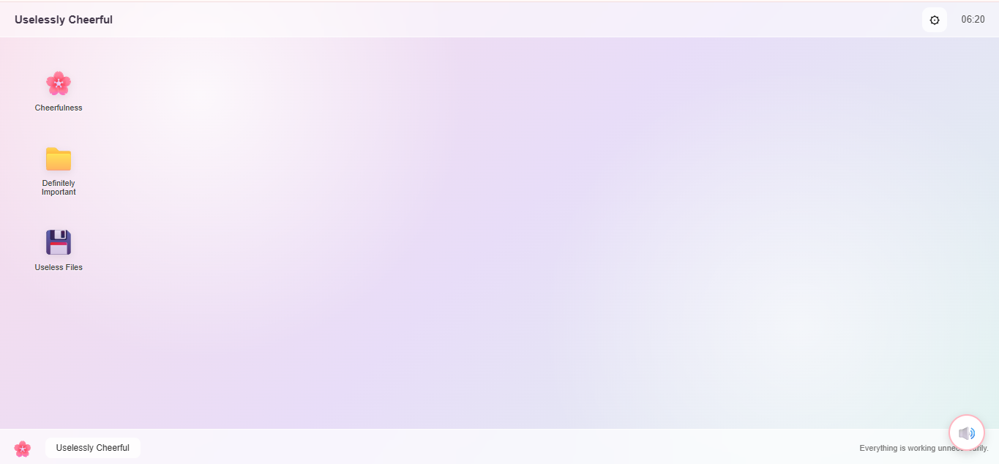
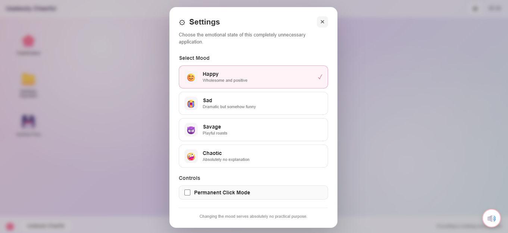
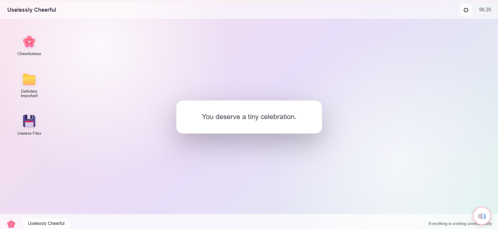
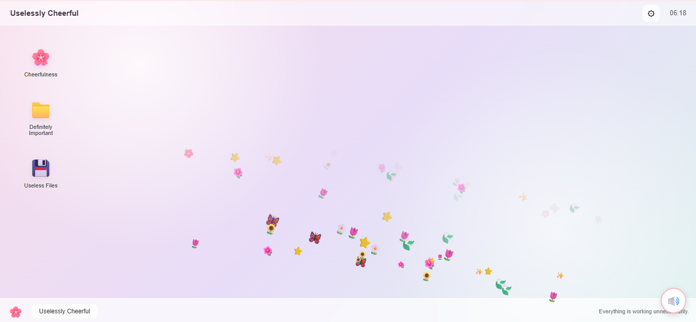

# Uselessly Cheerful 🌸

A completely unnecessary desktop experience designed to make your day slightly better, slightly weirder, and absolutely less productive.

## Basic Details

### Team Name: HAK

### Team Members

* Member 1: Ann Maria Benadict - Carmel College of Engineering and Technology
* Member 2: Khulood Salam - Carmel College of Engineering and Technology

### Project Description

**Uselessly Cheerful** is a fake desktop environment that does absolutely nothing useful — and that's the whole point.

Users can click a cheerful desktop icon to receive random messages based on their selected mood, while moving the mouse creates a trail of flowers, stars, leaves, and butterflies. The application also contains completely useless folders, files, settings, and other unnecessary features designed purely for entertainment.

### The Problem (that doesn't exist)

People are spending too much time being productive.

There is a serious lack of applications that solve absolutely no real-world problem while still demanding the user's attention.

Other applications try to improve productivity, organization, health, finances, or education.

**We decided to fix that.**

### The Solution (that nobody asked for)

We created **Uselessly Cheerful** — an application that turns an ordinary desktop into a completely unnecessary cheerful playground.

Choose your mood, click a flower, receive a random message, move your mouse to grow a digital garden, open folders containing absolutely nothing important, and discover files that have no purpose whatsoever. And when you are really in the mood make it al permanent.

It doesn't make your life easier.

It just makes it slightly more cheerful.

---

# Technical Details

## Technologies/Components Used

### For Software:

* **HTML5** – Structure of the application
* **CSS3** – Desktop UI, animations, gradients, popups and visual effects
* **JavaScript** – Application logic and interactions
* **Vanilla JavaScript** – No heavy frameworks or dependencies
* **Local Assets** – Images, sounds and other project resources
* **Git & GitHub** – Version control and project collaboration
* **VS Code** – Development environment

### Frameworks/Libraries:

* No major external framework
* No backend
* No database
* No API dependency
* Pure HTML, CSS and JavaScript

### Hardware:

No special hardware is required.

The project runs on a standard computer or laptop with a modern web browser.

---

# Implementation

## For Software:

The application is implemented as a browser-based fake desktop environment.

### 1. Fake Desktop Interface

The main screen is designed to resemble a simple desktop environment with:

* Application title bar
* Clock
* Settings icon
* Desktop icons
* Taskbar
* Fake folders and files
* Interactive visual elements

The interface uses CSS gradients, glassmorphism effects, shadows and smooth animations to create a lightweight desktop-like experience.

### 2. Mood-Based Message System

The user can select one of four moods:

* **Happy** – Wholesome and positive messages
* **Sad** – Dramatic but funny messages
* **Savage** – Playful roasts
* **Chaotic** – Completely unpredictable messages

When the **🌸 Cheerfulness** desktop icon is clicked, JavaScript randomly selects a message from the currently selected mood.

The message appears in a custom popup and automatically fades away after a few seconds.

### 3. Mouse Garden

The application tracks mouse movement.

When the user moves the mouse across the desktop, random objects appear around the cursor, including:

* 🌸 Flowers
* 🌼 Daisies
* 🌻 Sunflowers
* 🌷 Tulips
* 🌺 Flowers
* ✨ Sparkles
* ⭐ Stars
* 🍃 Leaves
* 🦋 Butterflies

The objects float upward and disappear automatically, preventing the screen from becoming permanently cluttered.

You can also toggle a permanent mode, where every click stamps a new object onto the screen...permanently. Till you hit all clear.

### 4. Fake Files and Folders

The desktop contains:

**📁 Definitely Important**

Clicking it displays a fake notification saying that there is absolutely nothing important inside.

**💾 Useless Files**

Clicking it informs the user that they have successfully discovered useless files.

These features intentionally imitate common desktop interactions while providing no practical functionality.

### 5. Settings and Mood Selection

The ⚙ settings button opens a custom settings panel.

Users can change the application's current mood. The selected mood is then used by the message-generation system.

The settings panel can be closed by:

* Clicking the × button
* Clicking outside the panel
* Pressing the Escape key

### 6. Keyboard Interaction

The application also includes simple keyboard interactions.

* Press **M** → displays a random useless message
* Press **Escape** → closes the settings panel or message popup

### 7. Automatic Clock

The top bar contains a live digital clock.

JavaScript updates the displayed hours and minutes every second.

### 8. Sound Integration

A floating sound button is included in the interface for integration with the sound module.

The sound functionality can be connected to the project's main JavaScript module without changing the core desktop interface.

At initial load the sound plays a very loving welcome message. You try to mute it using the sound button, congratulations you just rewound the sound from the start. Happy listening.

---

# Installation

Clone the repository:

```bash
git clone https://github.com/AnnMaria005/Useless-Projects-3.0-HAK
```

Navigate to the project directory:

```bash
cd useless_project
```

No additional packages or dependencies are required.

---

# Run

Since the project uses HTML, CSS and JavaScript, it can be run directly.

### Option 1: Open in Browser

Open:

```text
index.html
```

in a modern web browser.

### Option 2: VS Code Live Server

Open the project in VS Code and launch `index.html` using the **Live Server** extension.

The application will open in the browser.

---

# Project Documentation

## Screenshots

### Screenshot 1 – Useless Desktop



### Screenshot 2 – Mood Settings



### Screenshot 3 – Cheerful Message




### Screenshot 4 – Mouse Garden


---

# Diagrams

## Application Workflow

```text
                ┌──────────────────────┐
                │   Open Application   │
                └──────────┬───────────┘
                           │
                           ▼
                ┌──────────────────────┐
                │  Fake Desktop UI     │
                └──────────┬───────────┘
                           │
             ┌─────────────┼──────────────┐
             │             │              │
             ▼             ▼              ▼
      ┌────────────┐ ┌───────────┐ ┌──────────────┐
      │ Cheerfulness│ │ Settings  │ │ Mouse Garden │
      │    🌸      │ │    ⚙      │ │      🦋      │
      └──────┬─────┘ └─────┬─────┘ └──────┬───────┘
             │             │              │
             ▼             ▼              ▼
      ┌────────────┐ ┌───────────┐ ┌──────────────┐
      │ Random     │ │ Select    │ │ Generate     │
      │ Message    │ │ Mood      │ │ Visual       │
      └──────┬─────┘ └─────┬─────┘ │ Objects      │
             │             │       └──────┬───────┘
             ▼             ▼              ▼
      ┌────────────┐ ┌───────────┐ ┌──────────────┐
      │ Automatic  │ │ Update    │ │ Float &      │
      │ Fade Out   │ │ Current   │ │ Disappear    │
      └────────────┘ │ Mood      │ └──────────────┘
                     └───────────┘
```

*Workflow showing the main interactions and useless functionality provided by Uselessly Cheerful.*

---

# Project Demo

## Video

[Add your demo video link here]

*The demo video demonstrates the fake desktop interface, mood selection, random cheerful messages, mouse garden effects, fake folders/files and other intentionally useless interactions.*

---

# Additional Demos

* Live demonstration of the mood-based message system
* Mouse Garden interaction
* Fake folder and useless file notifications
* Settings and mood selection
* Keyboard shortcuts
* Sound module integration

---

# Team Contributions

* **[Ann Maria]:** Designed and implemented the fake desktop interface, mood-based message system, random message generation, settings panel, fake desktop icons, clock and message popup animations.

* **[Khulood]:** Developed the Mouse Garden module, including mouse tracking, random flowers, stars, leaves, butterflies, particle effects and permanent visual interactions. Worked on the sound module, audio interactions, UI integration, testing and overall project integration.

---

# Why Is This Project Useless?

Because it was never supposed to be useful.

It does not:

* Manage your tasks
* Track your expenses
* Predict the weather
* Improve your grades
* Increase productivity
* Solve world problems

Instead, it does something far more unnecessary:

**It gives you a random message when you click a flower.**

And honestly, that's enough.

---

# Future Useless Improvements

If we somehow find more time to waste, we may add:

* A button that does nothing but count how many times it was clicked
* Fake system updates
* Completely unnecessary notifications
* A "Do Not Press" button
* Fake error messages
* Random desktop wallpapers
* More chaotic moods
* More ridiculous sound effects
* A useless loading screen
* A button that tells you whether you should click another button
* A completely unnecessary achievement system

---

# Conclusion

**Uselessly Cheerful** is a deliberately pointless interactive application created for the TinkerHub Useless Project hackathon.

By combining a fake desktop interface, mood-based random messages, mouse-generated visual effects, fake files and folders, and unnecessary interactions, the project embraces the idea that software does not always need to solve a serious problem.

Sometimes an application can simply exist to make someone smile.

Or confuse them.

Or both.

---

Made with ❤️ and absolutely no practical purpose at **TinkerHub Useless Projects**.

[](https://www.tinkerhub.org/)

[](https://tinkerhub.org/events/1M8ORET9A1/useless-projects-3.0)
